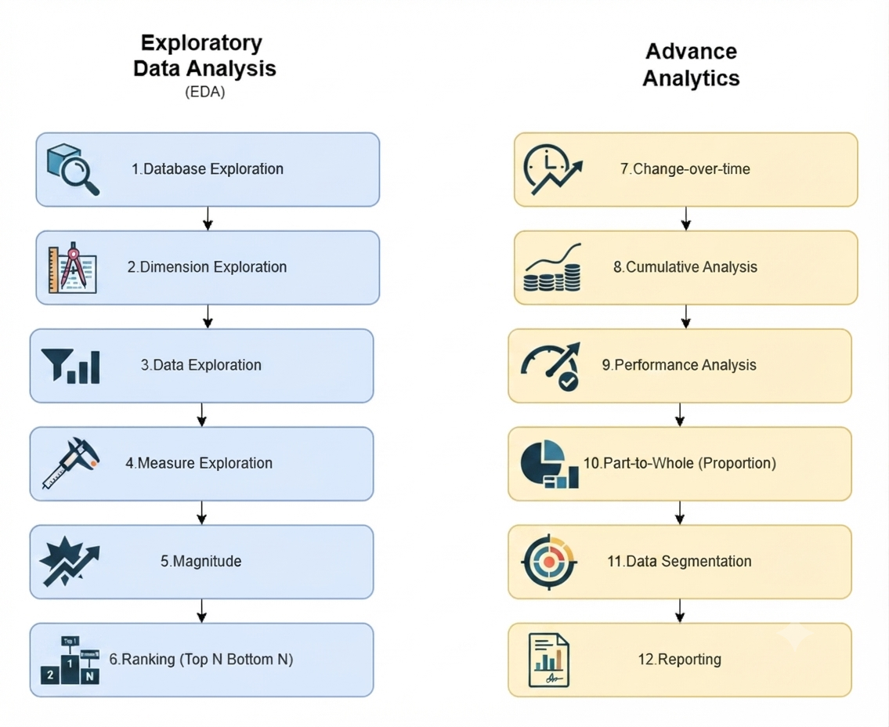

# sql-data-analytics-project
End-to-end SQL data analytics project featuring exploratory data analysis, advanced analytical queries, customer segmentation, and executive reporting.
# 📊 SQL Data Analytics Project

[](https://www.microsoft.com/en-us/sql-server)
[](LICENSE)
[]()

An advanced, end-to-end SQL data analytics project designed to transform raw business data into strategic insights. This repository features a structured, sequential workflow ranging from foundational **Exploratory Data Analysis (EDA)** to complex **Advanced Analytics** and executive-level reporting using **SQL Server**.

---

## 🏗️ Project Architecture & Workflow

The analysis follows a rigorous, two-stage analytical pipeline:



---

## 📂 Repository Structure

```text
sql-data-analytics-project/
│
├── datasets/            # Centralized dataset references
├── docs/                # Project documentation and workflow diagrams
├── scripts/             # Sequential SQL analysis scripts
│   ├── 01_database_exploration.sql
│   ├── 02_dimensions_exploration.sql
│   ├── 03_date_range_exploration.sql
│   ├── 04_measures_exploration.sql
│   ├── 05_magnitude_analysis.sql
│   ├── 06_ranking_analysis.sql
│   ├── 07_change_over_time_analysis.sql
│   ├── 08_cumulative_analysis.sql
│   ├── 09_performance_analysis.sql
│   ├── 10_data_segmentation.sql
│   ├── 11_part_to_whole_analysis.sql
│   ├── 12_report_customers.sql
│   └── 13_report_products.sql
│
├── LICENSE
└── README.md
